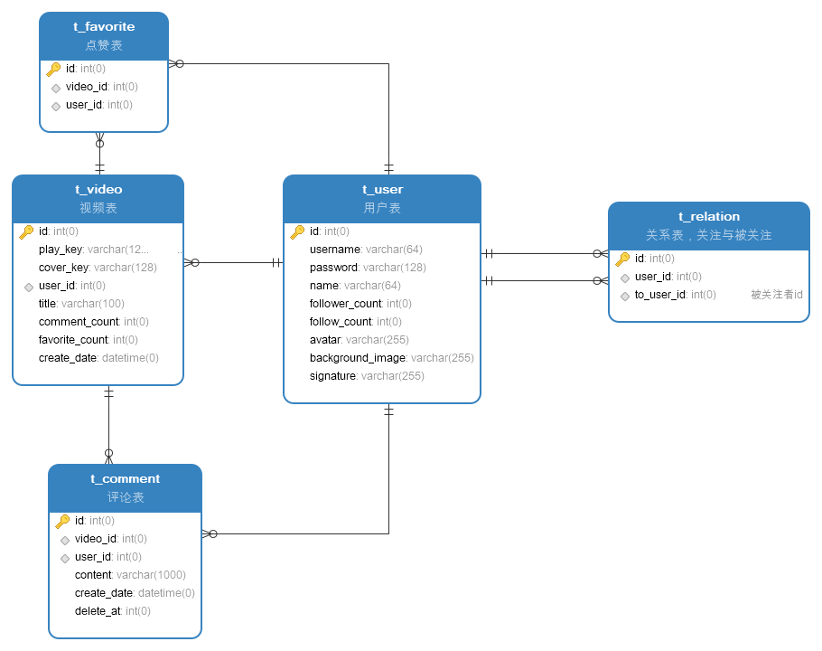
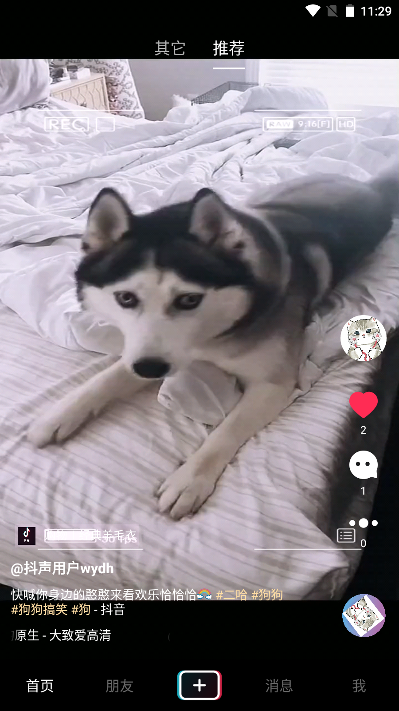
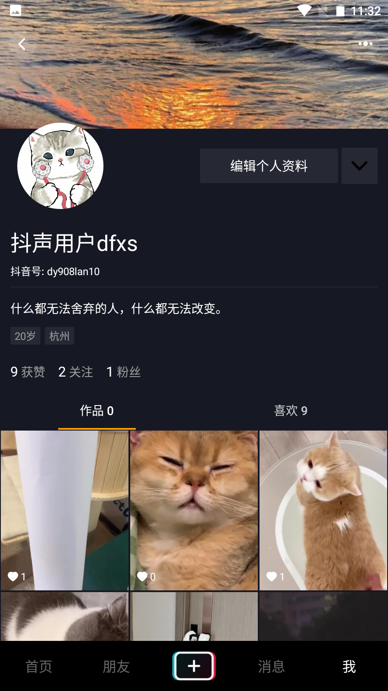
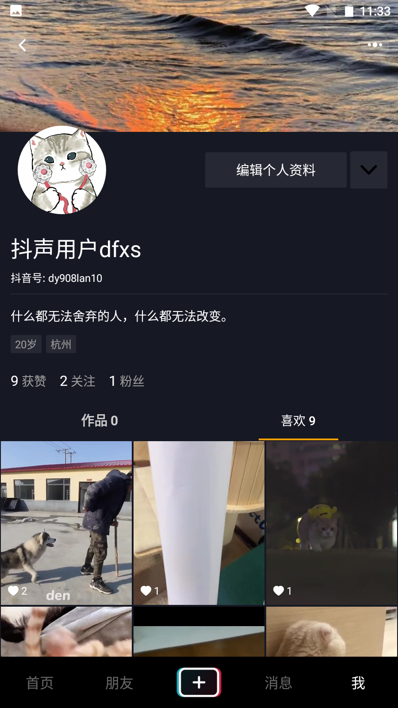

# 项目汇报

## 成员分工

| 成员           | 负责内容                                                                               |
| -------------- | -------------------------------------------------------------------------------------- |
| 朱朝阳         | 接口：视频流、投稿、用户登录、粉丝列表、评论操作、评论列表<br>其他：数据库设计、项目结构初始化、对接云存储 |
| 赵语云、石木子 | 项目的环境搭建：MySQL、Redis                                                           |
| 吴振宇         | 接口：赞操作、点赞列表                                                                 |
| 冀虹           | 接口：用户注册、用户信息、发布列表                                                     |
| ~~申永燕~~ 朱朝阳         | 接口：关注操作、关注列表                                                               |

## 技术说明

* 使用Gin作为web框架
* 使用七牛云对象存储来存储视频和封面
* 使用Redis缓存用户token和视频/图片链接
* 使用Gorm作为ORM框架
* 使用ffmpge提取视频某一帧作为视频封面

视频下载链接为带有过期时间的签名链接，避免重复创建链接，将链接缓存至redis，并给视频链接留有2小时的有效期

即`redis缓存过期时间+2H=链接过期时间`

由于客户端不支持token刷新操作（即JWT续约），选用Redis维护token过期时间，token有效期为30天，在15-30日之间有登录则会刷新token过期时间为30天

异常处理：初始化环境，如DB、Redis连接异常直接退出进程；业务异常，如查询错误等均使用error返回，controller层统一处理


## 项目结构

``` shell
│  go.mod
│  go.sum
│  main.go
│  README.md
│  
├─config
│      config.go
│      
├─constants
│      constants.go
│      
├─controller
│      commentController.go
│      favoriteController.go
│      relationController.go
│      userController.go
│      videoController.go
│      
├─db
│      commentDao.go
│      favoriteDao.go
│      init.go
│      relationDao.go
│      userDao.go
│      videoDao.go
│      
├─docs
│      comment.png
│      follow.png
│      follower.png
│      home.png
│      intro.md
│      likes.png
│      userinfo.png
│      
├─middleware
│      authMiddleware.go
│      
├─response
│      response.go
│      
├─router
│      commentRouter.go
│      favoriteRouter.go
│      init.go
│      relationRouter.go
│      userRouter.go
│      videoRouter.go
│      
├─service
│      commentService.go
│      favoriteService.go
│      relationService.go
│      userService.go
│      videoService.go
│      
├─sql
│      heart.sql
│      
├─tmp
└─util
    ├─authutil
    │      authutil.go
    │      authutil_test.go
    │      
    ├─md5util
    │      md5util.go
    │      md5util_test.go
    │      
    ├─randomutil
    │      randomutil.go
    │      
    ├─redisutil
    │      common.go
    │      encode.go
    │      redisutil.go
    │      redisutil_test.go
    │      
    └─videoutil
            videoutil.go
            videoutil_test.go
```
采用 controller => service => dao 分层模式
* config     项目配置，包含DSN、Redis、七牛云、各过期时间等
* constants  系统常量
* controller handlers
* db         dao层，db的初始化和各dao层api
* docs       介绍文档
* middleware 中间件，主要是鉴权
* response   通用返回体
* router     路由配置，以及中间件绑定
* service    服务层
* sql        sql文件，包含结构和数据
* tmp        项目启动时生成，用于保存投稿时产生的临时文件
* util       工具类，包含鉴权、md5（加密存储）、随机数（用户注册生成随机名称）、Redis（封装API）、视频工具类（提取封面、上传下载等）

## 数据库设计

部分字段反范式设计，例如评论数、点赞数，方便查询，数据更新时使用事务

用户头像等数据使用默认值，没有接口修改这些数据

索引方面：user表中username使用唯一索引，所有表id均为主键id且自增


数据库模型

## 启动环境

### MySQL

可在项目/config/config.go中修改DSN

例如：`root:123456@tcp(127.0.0.1:3306)/heart?charset=utf8&parseTime=True`

SQL文件在/sql/heart.sql

### Redis

可在项目/config/config.go中修改Redis配置

`Redis_addr`为redis地址，例如：`127.0.0.1:6379`

`Redis_password`为redis密码，为空则不需要密码

`Redis_db`为redis数据库，默认为0

### ffmpeg

获取视频封面用到了`ffmpeg`，需要此环境[ffbinaries.com/downloads](https://ffbinaries.com/downloads)

windows环境选择**windows-64**下载解压得到一个 .exe 文件，放置到 GOPATH 下的 bin 目录即可 

获取封面方案参考掘金文章：[GoLang 项目实战：通过视频生成缩略图作为封面｜青训营笔记](https://juejin.cn/post/7099827417170051103)

Ubuntu下安装ffmpeg参考：[Ubuntu安装ffmpeg](https://blog.csdn.net/qq_45033722/article/details/123458282)

## 难点突破

编写视频流接口时，由于视频和图片存储在云端，且以key作为关联云端的字段，数据库不直接存储资源的链接。需要签名生成私有链接并缓存至redis，并且需要封装视频作者信息，无法在一条sql语句完成视频信息的封装。初始方案是遍历视频基础信息，逐个封装信息后返回。实际测试此方案耗时严重，后改用协程进行封装。改进后响应时间由2s优化至100ms。其他视频列表接口均以此方案编写。

查询用户信息时采用一条SQL查询。对于是否关注需要联表查询。Gorm的关联查询与之前的一对一、一对多、多对多不同，Gorm是has one/many等（或许是不熟悉），所以自己编写SQL语句，使用按列子查询完成是否关注的查询。


## 项目展示

线上地址：http://203.6.231.61:5005/

可用账号：
``` js
username:jxygzzy password:123456 // 主要测试账号
username:heart   password:123456 // 辅助测试账号
```

### 截图展示


首页


用户界面


喜欢列表


评论列表


关注列表


粉丝列表

## 鸣谢

[字节跳动青训营](https://youthcamp.bytedance.com/)